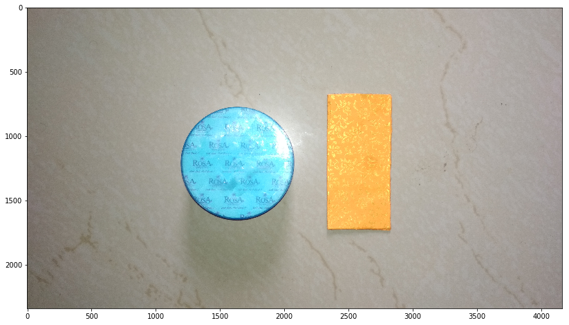
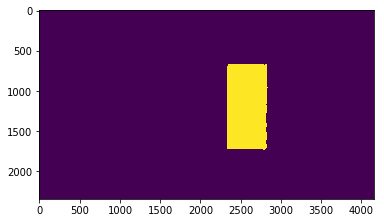
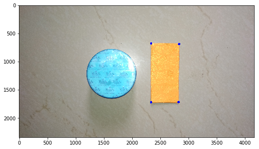
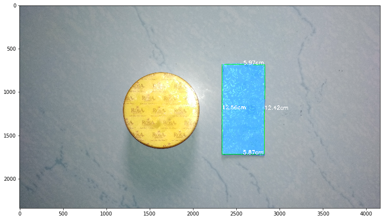

# Scale construction using Computer Vision

This is a general implementation of computer vision to measure the size, shape and curvature of an object 


Let's begin with importing libs for our this task


```python
"""
Author: Nikhil Pandey
@ Nikhilpandey360.github.io
"""

import cv2
import numpy as np
import matplotlib.pyplot as plt
%matplotlib inline
import math
from scipy.spatial import distance as dist

```

After importing the necessary libraries lets open the image and view what's in it for us.


```python
image  = cv2.imread("cld_1.jpg")
image_ = cv2.cvtColor(image, cv2.COLOR_BGR2RGB)
 
fig = plt.figure(figsize=(15,8))
y = fig.add_subplot(1,1,1)
y.imshow(image_)
plt.show()
```





First of all, **sorry** for such a simpleton photograph. Couldn't find anything else!!!

Now, the object in golden orange color is our Marker. 
We know the length and width of the marker. What we going to do in this tutorial is that we would construct the scale with the help of this marker.

Our ultimate aim is to measure an object of unknow size **the blue thing** using a scale that we calculated from another object whose dimensions are know to us **the orange rectangle thing**

**Now what's this "SCALE" thing I keep saying???**

Well, from scale I simply mean how many pixels are required to indicate a unit centimeter.

For example suppose it takes 500 pixels in an image of 5 MP to represent a straight length of 10cm, we would say roughly 50 pixels is required to construct a straight line of 1cm. Easy! no? ~.~

## Marker extraction

You may see that there are two object in this particular image. How do we know which one's the marker after all a scale would be only as accurate as we can extact the marker. Here precision is the key. 
We can do couple of thing:
- Use Supervised Machine Learing to Locate the Marker 
- Use Computer Vision to Locate the Marker 

Both of these have their own pros and cons but being the damn passimistic person that I am, we shall discuss the cons of both approaches

### Cons of ML
- Requires large training data
- Expensive in terms of computation
- Higher Memory Uses
- Tends to Overfit if trained by amatures

### Cons of CV
- **Highly** depended on the fixed parameters
- Change in light conditions may make it go bananas
- Lack of uniformity i.e. A set of parameter may work of one image while can totally be darned in the other

However, the main reason for opting a CV based algorithm might be its speed. Almost instantly we'd get the scale in the case of a CV algorithm and in the case of ML based algorithm, different approaches such as segmentation via deep learning, sliding window approac etc may take quite a while to loacate the marker in the first place. Even after that they'd require some CV for the calculation of distances. 

In this case it was easier to segment on the basis of color as the object are quite different in color.


```python
# Lets extract the marker 
# please refer to the hsv_range_manager.py to know the hsv range that your marker fall under.

mark_hsv_l = [0,80,213]
mark_hsv_h = [62,255,255]

hsv_marker = cv2.cvtColor(image, cv2.COLOR_BGR2HSV)

mark_hsv_l = np.array(mark_hsv_l,np.uint8)
mark_hsv_h = np.array(mark_hsv_h,np.uint8)

frame_threshed = cv2.inRange(hsv_marker, mark_hsv_l, mark_hsv_h)

fig=plt.figure()
y=fig.add_subplot(1,1,1)
y.imshow(frame_threshed)
plt.show()

```





This binary image represent segmentation of marker from its background. This is may be the easiest case possible as realy life situation are rarely this neat!

Now, we know where the marker is in the image. We are going to find the contours. As you may see, the marker itself is the biggest contour in the above image. The point of contouring is to locate this blob and make it avail for further analysis. 


```python
_,contours,hierarchy=cv2.findContours(frame_threshed,cv2.RETR_TREE,cv2.CHAIN_APPROX_SIMPLE)

# Max area cnt in the above image will be of the marker for sure
cnt = max(contours, key=cv2.contourArea)
```

So now we have the marker as the contour we needed. This contour will be further processed to get the 4 corners of the rectangular marker. 

The function  `cv2.approxPolyDP()`  is based on Douglas-Peucker algorithm which is implemented in openCV. It is used to find approximate shape of the objects. Now this may seem unnecessary as we could have fitted minimum area rectangle using `cv2.minAreaRect()` function on the contour but In my experience I have found that the later approach tends to create a little bit of error. Since we are dealing with a precision system we much thrive for as much precesion we can get without taking up too much resources.


```python
canvas = np.zeros(image.shape, np.int8)

# Adjust the arc Length approximation as it works for you
epsilon = 0.05*cv2.arcLength(cnt, True)
approx = cv2.approxPolyDP(cnt, epsilon, True)

print (len(approx))

im = cv2.drawContours(image_, approx,-1, (0,0,255),40)
fig = plt.figure(figsize=(12,5))
y = fig.add_subplot(1,1,1)
y.imshow(im)
plt.show()
```

    4





These four blue points on the marker are the corners that we need to calculate the distances.
Now why the length of the approx which is 4, is important!? Well, you see, I'm dealing with rectangle and precisly aming for 4 points and as it turns out the system is approximate so it might happen that more than 4 point of inflection detected. Thus check before you get trouble later.


```python
# Simple function to calculate the distances
def distance(p0, p1):
    return math.sqrt((p0[0] - p1[0])**2 + (p0[1] - p1[1])**2)
```

In the following cell, the four points are being analysed. We are now gonna create a list that will contain distance in terms of pixels of the following:

(let A,B,C,D are the points respectively)

- Diagonal AC
- DIagonal BD
- Sides a,b,c,d


```python

p1, p2= [0,0]
maximum = 0
distance_ls = []
end = len(approx)

for i in range(end):
    for b in range(i+1,end):
        a = distance(approx[i][0],approx[b][0])
        distance_ls.append(a)
        distance_ls = sorted(distance_ls,reverse=True)

        if max(distance_ls) <= a:
            maxumum = a
            p1 = approx[i][0]
            p2 = approx[b][0]
            b = distance(p1,p2)
            
```

There have to have some better elegant way of doing this task. Pull request anyone?


since we have identified 4 corners of the marker,
the number of possible distances must be 4C2 i.e. 4 x3/ 2x1 = 6


```python
print len(distance_ls)
```

    6


Cool! 

Now just store the the cordinates of these four corners. It seems easier to extract the coordinates from the approx array


```python
loc_arr = []
for i in range(len(approx)):
    loc_arr.append(approx[i][0])
```

## Scale calculation
Since we have both the diameters in terms of pixels and it is given that the marker length and width is known to the user, we are simply going to divide them to get the ratio(scale). Now, if later we calculate a distance of anything in terms of pixel, all we need to do is to multiply by the scale we got from marker to get the distace value in centimeters. 


```python

ac=distance_ls[0]                 #Diagonal 1(the list is sorted)
bd = distance_ls[1]               #Diagonal 2

actual_width = 5.9               #(59 mm)
actual_length = 12.5               #(125 mm)

# Pythagoras theorem
diagonal = ((actual_length**2)+(actual_width**2))**0.5

# Divide the actual diagonals by  both the calculated diagonals to get cm/pixel ratio

var1 = np.divide(diagonal,ac)
var2 = np.divide(diagonal,bd)


```

A way to minimise error is to take multiple samples and take average of them. The same is being done here.
Var1, Var2 are the two possible ratios as both represents scale. One can use either but the best way is to use both
Remember how rms values worked??? I'm not taking mean yet the point of RMS remain intact here.


```python
scale = float((var2*var1)**0.5)
print(scale)
```

    0.012056448668


## Validation of the marker scale

Guess what, we can actually know how accuarate our marker scale is, right away!

Before you think anything remotely complicated, here's the thing- We have calculated, we calculated the scale using the real diagonals of the marker. If we use the scale to calculate back the length and width, we must get a very anwers!

We have this list containing the cordinates of the corners of the marker, lets join them and see how far apart the points are!
The original dimension of the marker is 5.9 x 12.5 cmsquare!


```python
# formality, you'll see where it is used!
text_color= [255,255,255]
text_width = 2
text_size =6
```


```python

"""This function takes in a list of coordinates and arrange them and returns another list!"""
def order_points(pts):
    pts=np.int0(pts)

    xSorted = pts[np.argsort(pts[:, 0]), :]

    # grab the left-most and right-most points from the sorted
    # x-roodinate points
    leftMost = xSorted[:2, :]
    rightMost = xSorted[2:, :]

    # now, sort the left-most coordinates according to their
    # y-coordinates so we can grab the top-left and bottom-left
    # points, respectively
    leftMost = leftMost[np.argsort(leftMost[:, 1]), :]
    (tl, bl) = leftMost
    
    """ now that we have the top-left coordinate, use it as an
    anchor to calculate the Euclidean distance between the
    top-left and right-most points; by the Pythagorean
    theorem, the point with the largest distance will be
    our bottom-right point
    """
    D = dist.cdist(tl[np.newaxis], rightMost, "euclidean")[0]
    (br, tr) = rightMost[np.argsort(D)[::-1], :]

    # return the coordinates in top-left, top-right,
    # bottom-right, and bottom-left order
    return np.array([tl, tr, br, bl], dtype="float32")


def midpoint(ptA, ptB):
    '''
    This function takes input two points (x1,y1) and (x2,y2)
    return the midpoint.
    '''
    return ((ptA[0] + ptB[0]) * 0.5, (ptA[1] + ptB[1]) * 0.5)
```


```python
loc_arr = order_points(loc_arr)
loc_arr
```


    array([[ 2337.,   676.],
           [ 2832.,   685.],
           [ 2823.,  1715.],
           [ 2336.,  1718.]], dtype=float32)


Notice that the array is ordered now!

In the following block of code we are going to calculate the distances and put those values in the image it self for demonstration/inspection


```python


box=loc_arr.copy()

if len(loc_arr) == 4:
    for (x, y) in box:
        image_=image.copy()
        (A, B, C, D) = box
        cv2.line(image_,(A[0],A[1]),(B[0],B[1]),(0,255,0),3)
        cv2.line(image_,(C[0],C[1]),(D[0],D[1]),(0,255,0),3)

        cv2.line(image_,(A[0],A[1]),(D[0],D[1]),(0,255,0),3)
        cv2.line(image_,(B[0],B[1]),(C[0],C[1]),(0,255,0),3)

        (ma, mb) = midpoint(A, B)
        (mc, md) = midpoint(C, D)
        # compute the midpoint between the top-left and top-right points,
        # followed by the midpoint between the top-righ and bottom-right
        (mA, mD) = midpoint(D,A)
        (mB, mC) = midpoint(B, C)
      

    
        #Calculate the distances and multyply it by scale
        ab= dist.euclidean((A[0], A[1]), (B[0], B[1])) *scale
        bc= dist.euclidean((C[0], C[1]), (B[0], B[1])) *scale
        cd = dist.euclidean((C[0], C[1]), (D[0],D[1])) *scale
        ad = dist.euclidean((A[0], A[1]), (D[0], D[1])) *scale
        
        dis_ls = [ab,bc,cd,ad]
        
#         put text on the mid of the linesegment whose distance is being calculated
        cv2.putText(image_,"{:.2f}cm".format(ab),
            (int(ma), int(mb)), cv2.FONT_HERSHEY_SIMPLEX,
            text_width, text_color, text_size)

        cv2.putText(image_, "{:.2f}cm".format(bc),
            (int(mB),int(mC)), cv2.FONT_HERSHEY_SIMPLEX,
            text_width, text_color, text_size)

        cv2.putText(image_, "{:.2f}cm".format(cd),
            (int(mc), int(md)), cv2.FONT_HERSHEY_SIMPLEX,
            text_width, text_color, text_size)

        cv2.putText(image_, "{:.2f}cm".format(ad),
            (int(mA), int(mD)), cv2.FONT_HERSHEY_SIMPLEX,
            text_width, text_color, text_size)
```


```python
fig = plt.figure(figsize=(12*1.50, 5*1.50))
y = fig.add_subplot(1,1,1)
y.imshow(image_)
cv2.imwrite("scale.jpg", image_)
```


    True





Pretty neat right?
Lets see how what's status of our error!


```python
dis_ls
```


    [5.968928520678735, 12.41861602653342, 5.871601985200332, 12.562825398992219]


Hmmm!!!


```python
print(abs(actual_width-dis_ls[0])*100/actual_width,
abs(actual_length-dis_ls[1])*100/actual_length,
abs(actual_width-dis_ls[2])*100/actual_width,
abs(actual_length-dis_ls[3])*100/actual_length)
```

    (1.1682800115039738, 0.6510717877326471, 0.4813222847401407, 0.5026031919377516)


Woah!!! You do realise that our maximum error is 1.16%!!!
That's more than good enough. Well 0 error is always desired but in practice anything less than 4-5% is good enough!
Head over the `measuring_object_cv.ipnb` notebook to see how to measure the object of unknown dimension.


```python

```
